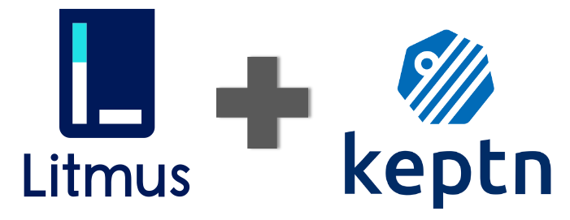

# Litmus Service


[](https://goreportcard.com/report/github.com/keptn-sandbox/litmus-service)



This service provides a way to perform chaos tests on your applications triggered by [Keptn](https://keptn.sh) using 
the [LitmusChaos](https://litmuschaos.io) framework. 

## Compatibility Matrix

| Keptn Version    | [litmus-service Docker Image](https://hub.docker.com/r/keptnsandbox/litmus-service/tags) |
|:----------------:|:----------------------------------------:|
|       0.7.1      | keptnsandbox/litmus-service:0.1.0 |
|       0.7.2      | keptnsandbox/litmus-service:0.1.0 |
|       0.7.3      | keptnsandbox/litmus-service:0.1.1 |
|       0.8.0      | keptnsandbox/litmus-service:0.2.0 (to be released soon) |


## Prerequisites

The Keptn *litmus-service* requires the following prerequisites to be setup on the Kubernetes cluster for it to run the chaos tests:  

- LitmusChaos custom resource definitions (CRDs)
- The Chaos Operator 
- The `ChaosExperiment` custom resources (CRs)
- The RBAC (`serviceaccount`, `role`, `rolebinding`) associated with the chaos test 

Execute the following commands to setup these dependencies for a demo setup: 

```console
kubectl apply -f ./test-data/litmus/litmus-operator-v1.9.1.yaml
kubectl apply -f ./test-data/litmus/pod-delete-ChaosExperiment-CR.yaml 
kubectl apply -f ./test-data/litmus/pod-delete-rbac.yaml 
```

## Keptn CloudEvents

This service reacts on the following Keptn CloudEvents (see [deploy/service.yaml](deploy/service.yaml)):
* `sh.keptn.events.deployment-finished` -> start litmus chaos tests
* `sh.keptn.events.tests-finished` -> clean up residual chaos resources


**Notes**: 

- This repo provides the example (yaml specifications) of a [pod-delete](https://docs.litmuschaos.io/docs/pod-delete/) chaos test. 
You can choose to specify other [experiments](https://hub.litmuschaos.io/) depending on your need, when building your own litmus service. 
Ensure that the correct `ChaosEngine` spec is provided in the [experiment manifest](./test-data/litmus/experiment.yaml) along with the 
corresponding `ChaosExperiment` CR & RBAC manifests. 

- This repo uses the sample [*carts*](https://github.com/keptn-sandbox/litmus-service/tree/master/test-data/carts) app as the Application-Under-Test (AUT)   to illustrate the impact of chaos. Hence, the [experiment](./test-data/litmus/experiment.yaml) is populated with the respective attributes for app filtering purposes. Ensure you have the right data placed in the `spec.appinfo` when adopting this for your environments.

## Installation -  Deploy in your Kubernetes cluster

To deploy the current version of the *litmus-service* in your Keptn Kubernetes cluster, clone the repo and apply the [`deploy/service.yaml`](deploy/service.yaml) file:

```console
kubectl apply -f deploy/service.yaml
```

This will install the `litmus-service` into the `keptn` namespace, which you can verify using:

```console
kubectl -n keptn get deployment litmus-service -o wide
kubectl -n keptn get pods -l run=litmus-service
```


### Usage

To make use of the Litmus service, a dedicated `experiment.yaml` file with the actual chaos experiment has to be added to Keptn (for the service under test).

You can do this via the Keptn CLI, please replace the values for `project`, `stage`, `service` and `resource` with your actual values. But note that the `resourceUri` has to be set to `litmus/experiment.yaml`.

```
keptn add-resource --project=litmus --stage=chaos --service=carts --resource=litmus/experiment.yaml --resourceUri=litmus/experiment.yaml 
```

Please note that it is recommended to run the chaos experiment along with some load testing. 
Now when a `send-test` event is sent to Keptn, the chaos test will be triggered along with the load tests. Once the load tests are finished, Keptn will do the evaluation and provide you with a result. With this you can then verify if your application is resilient in the way that your SLOs are still met.


## How does the service work?

The service implements [handlers](https://github.com/keptn-sandbox/litmus-service/blob/master/eventhandlers.go) for triggering the chaos tests in the "testing phase" of Keptn, that means that Keptn will trigger the chaos tests right after deployment. The test is executed by a set of *chaos pods* (notably, the *chaos-runner* & *experiment* pod) and the test results stored in a `ChaosResult` custom resource. The duration of the test & other tunables can be configured in the `ChaosEngine` resource. Refer to the [Litmus docs](https://docs.litmuschaos.io/docs/chaosengine/) on supported tunables. Litmus ensures that the review app/deployment is restored to it's initial state upon completion of the test.

The Keptn litmus-service also [conditionally](https://github.com/keptn-sandbox/litmus-service/blob/master/deploy/service.yaml#L68) generates & handles the `test.finished` event by cleaning up residual chaos resources (*running* or *completed*) in the cluster. 

It is a standard practice to execute the chaos tests in parallel with other performance/load tests running on the AUT. The subsequent quality gate evaluations
in such cases are more reflective of real world outcomes. 

**Note**: The sample project provided in this repo (in the `test-data` folder), uses a [jmeter](https://github.com/keptn-sandbox/litmus-service/tree/master/test-data/jmeter) load test 
against the AUT, *carts*, running in parallel with the pod-delete chaos test.

## Uninstall -  Delete from your Kubernetes cluster

To delete the litmus-service, delete using the [`deploy/service.yaml`](deploy/service.yaml) file:

```console
kubectl delete -f deploy/service.yaml
```

## Upgrade or Downgrading

Adapt and use the following command in case you want to upgrade or downgrade your installed version (specified by the `$VERSION` placeholder):

```console
kubectl -n keptn set image deployment/litmus-service litmus-service=keptnsandbox/litmus-service:$VERSION --record
```

### Configuring the Service

- The service implements simple handlers for the `sh.keptn.event.test.triggered` & `sh.keptn.event.test.finished` events - i.e., triggers chaos by creating the `ChaosEngine` resource, fetching info from `ChaosResult` resource & eventually deleting them, respectively. In case you would need additional functions/capabilities,  update the [eventhandlers.go](https://github.com/keptn-sandbox/litmus-service/blob/master/eventhandlers.go). For more info around how to go about this, view the **Development** section.

- Considering the litmus-service runs in the keptn namespace & acts on resources/applications on other namespaces (as per the project/stage names), it uses a cluster-wide RBAC. Tune the [permissions](https://github.com/keptn-sandbox/litmus-service/blob/master/deploy/service.yaml#L17) associated with this service based on functionality needed apart from CRUD on `ChaosEngine` & `ChaosResults`. 

- In case you would like to cleanup chaos resources immediately after completion of the chaos test (either because you aren't running other tests of primary significance such as perf tests), set the environment variable `SEND_TEST_FINISHED_EVENT` to `true` in the litmus-service deployment.


## Development

Development can be conducted using any Golang compatible IDE/editor (e.g., Jetbrains GoLand, VSCode with Go plugins).

It is recommended to make use of branches as follows:

* `master` contains the latest potentially unstable version
* `release-*` contains a stable version of the service (e.g., `release-0.1.0` contains version 0.1.0)
* create a new branch for any changes that you are working on, e.g., `feature/my-cool-stuff` or `bug/overflow`
* once ready, create a pull request from that branch back to the `master` branch

When writing code, it is recommended to follow the coding style suggested by the [Golang community](https://github.com/golang/go/wiki/CodeReviewComments).

### Where to start

If you don't care about the details, your first entrypoint is [eventhandlers.go](eventhandlers.go). Within this file you can add implementation for pre-defined Keptn Cloud events.
 
To better understand Keptn CloudEvents, please look at the [Keptn Spec](https://github.com/keptn/spec).
 
If you want to get more insights, please look into [main.go](main.go), [deploy/service.yaml](deploy/service.yaml), consult the [Keptn docs](https://keptn.sh/docs/) as well as existing [Keptn Core](https://github.com/keptn/keptn) and [Keptn Contrib](https://github.com/keptn-contrib/) services.

### Common tasks

* Build the binary: `go build -ldflags '-linkmode=external' -v -o litmus-service`
* Run tests: `go test -race -v ./...`
* Build the docker image: `docker build . -t keptnsandbox/litmus-service:dev` (Note: Ensure that you use the correct DockerHub account/organization)
* Run the docker image locally: `docker run --rm -it -p 8080:8080 keptnsandbox/litmus-service:dev`
* Push the docker image to DockerHub: `docker push keptnsandbox/litmus-service:dev` (Note: Ensure that you use the correct DockerHub account/organization, e.g., your personal account like `docker push myaccount/litmus-service:dev`)
* Deploy the service using `kubectl`: `kubectl apply -f deploy/`
* Delete/undeploy the service using `kubectl`: `kubectl delete -f deploy/`
* Watch the deployment using `kubectl`: `kubectl -n keptn get deployment litmus-service -o wide`
* Get logs using `kubectl`: `kubectl -n keptn logs deployment/litmus-service -f`
* Watch the deployed pods using `kubectl`: `kubectl -n keptn get pods -l run=litmus-service`
* Deploy the service using [Skaffold](https://skaffold.dev/): `skaffold run --default-repo=your-docker-registry --tail` (Note: Replace `your-docker-registry` with your DockerHub username; also make sure to adapt the image name in [skaffold.yaml](skaffold.yaml))


### Testing Cloud Events

We have dummy cloud-events in the form of [RFC 2616](https://ietf.org/rfc/rfc2616.txt) requests in the [test-events/](test-events/) directory. These can be easily executed using third party plugins such as the [Huachao Mao REST Client in VS Code](https://marketplace.visualstudio.com/items?itemName=humao.rest-client).

## Automation

### GitHub Actions: Automated Pull Request Review

This repo uses [reviewdog](https://github.com/reviewdog/reviewdog) for automated reviews of Pull Requests. 

You can find the details in [.github/workflows/reviewdog.yml](.github/workflows/reviewdog.yml).

### GitHub Actions: Unit Tests

This repo has automated unit tests for pull requests. 

You can find the details in [.github/workflows/tests.yml](.github/workflows/tests.yml).

### Travis-CI: Build Docker Images

This repo uses [Travis-CI](https://travis-ci.org) to automatically build docker images. This process is optional and needs to be manually 
enabled by signing in into [travis-ci.org](https://travis-ci.org) using GitHub and enabling Travis for your repository.

After enabling Travis-CI, the following settings need to be added as secrets to your repository on the Travis-CI Repository Settings page:

* `REGISTRY_USER` - your DockerHub username
* `REGISTRY_PASSWORD` - a DockerHub [access token](https://hub.docker.com/settings/security) (alternatively, your DockerHub password)

Furthermore, the variable `IMAGE` needs to be configured properly in the respective section:
```yaml
env:
  global:
    - IMAGE=keptnsandbox/litmus-service 
```
You can find the implementation of the build-job in [.travis.yml](.travis.yml).

## How to release a new version of this service

It is assumed that the current development takes place in the master branch (either via Pull Requests or directly).

To make use of the built-in automation using Travis CI for releasing a new version of this service, you should

* branch away from master to a branch called `release-x.y.z` (where `x.y.z` is your version),
* write release notes in the [releasenotes/](releasenotes/) folder,
* check the output of Travis CI builds for the release branch, 
* verify that your image was built and pushed to DockerHub with the right tags,
* update the image tags in [deploy/service.yaml], and
* test your service against a working Keptn installation.

If any problems occur, fix them in the release branch and test them again.

Once you have confirmed that everything works and your version is ready to go, you should

* create a new release on the release branch using the [GitHub releases page](https://github.com/keptn-sandbox/litmus-service/releases), and
* merge any changes from the release branch back to the master branch.

## License

Please find more information in the [LICENSE](LICENSE) file.
